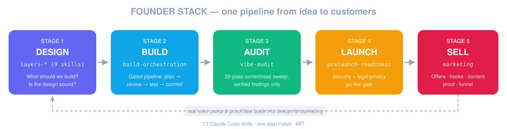

# Founder Stack

**Design, build, ship & sell — the full product arc as Claude Code skills.**



## How to use it — your project, step by step

After [installing](#install-one-step-installs-everything), open Claude Code in your
project folder and walk the stages. Each stage is just something you **type into the
chat** — the skill takes over, asks you questions in plain language, and tells you
what to run next. You never need to remember the whole map; this section is it.

**1 · DESIGN — before you build (15–30 min)**
Type `/layers-intro`, then `/layers-orient`. It asks ~7 questions about your idea
(who is it for, what do you know about them, what exists already…) and shows you a
table of what's solid and what's guesswork. It then names ONE thing to work on and
which `/layers-…` skill to run for it. Run that skill, answer its questions, repeat
until the foundations feel solid. *Existing project? Same commands — orient audits
what you already have instead of starting from zero.*

**2 · BUILD — set up once, then use daily**
Type `set up build orchestration`. One-time install into this project (it detects
your folders, asks you to confirm, tells you to restart Claude Code). From then on,
start every piece of work with `/change` — e.g. `/change add a login page`. The
pipeline plans first, asks YOU before big decisions, reviews and tests before every
commit. This is the stage you live in most days.

**3 · AUDIT — every week or two, and before big merges**
Type `vibe-audit this code`. Fully automatic — no questions. Come back to a report
of confirmed bugs sorted by severity, with a suggested fix order. Fix the top ones
with `/change fix …`, then keep building.

**4 · LAUNCH — once, when you're ready to go live**
Type `run the pre-launch readiness check`. It scans your code, asks only what code
can't reveal (where are your users, do you send email…), and returns one verdict:
ready / ready after N fixes / not yet — with security fixes as ready-to-run prompts
and draft legal docs (privacy policy, cookie notice, terms) marked for lawyer review.

**5 · SELL — after launch, and whenever you need content**
Type `create offers for this app`. First run: it reads your project, drafts a summary
of your product and audience, and asks you to confirm — that becomes its memory for
this project. Then ask for what you need: `write hooks`, `make a content plan`,
`audit my funnel`. Everything lands as files in a `marketing/` folder you can reuse.

**Three rules of thumb:** you can enter at any stage (already built? start at 3);
every skill ends by telling you a sensible next step; and nothing here edits your
product code without showing you first.

---

Fifteen core skills plus a 16-scanner SAST suite, covering the full arc of building
software: **decide what to build**,
**build it with discipline**, **verify the code is correct**, **gate the launch**,
and **get customers**. Five stages, one pipeline:

1. **`layers-*`** (9 skills) — *"What should we build, and is the design sound?"*
   The Layers of Product Design framework: user research → domain → needs →
   strategy → conceptual model → interaction flow → surface. Run before and during
   design.
2. **`build-orchestration`** — *"How do I **build** without the AI going rogue?"*
   Installs a 5-agent discipline pipeline (`plan → implement → review → audit →
   test → commit`) + `/change` command into any project. Run once per project.
3. **`vibe-audit`** — *"Is the **code** actually correct and robust?"*
   Correctness, reliability, performance, tests. Run anytime, repeatedly, during dev.
4. **`prelaunch-readiness`** — *"Is this safe and legally covered enough to **launch**?"*
   Security + legal/privacy. Run once before go-live.
5. **`marketing`** + **`first-customer-finder`** — *"How do I get **customers** for this?"*
   Hormozi-style offers, hooks, content calendar, proof, funnel audit — plus an
   evidence-backed hunt for the actual first people to talk to.

Plus one cross-stage utility: **`loop-advisor`** — *"Which Claude Code loop do I
need?"* Routes any "automate this / keep doing X / check every N minutes" request
to the right primitive (`/goal`, `/loop`, `/schedule`, or no loop at all) and sets
every parameter — stop conditions, turn caps, intervals, permissions — explicitly.
Based on the Claude Code team's [loop taxonomy](https://claude.com/blog/getting-started-with-loops).

All are **honest by construction** — no fabricated findings, no fabricated
testimonials, no invented product facts, design models flagged as hypotheses until
there's evidence. Plain Markdown Claude Code reads — no build, no dependencies.

> Formerly named `prelaunch-readiness` — renamed when the toolkit grew past its
> first skill. Old links and clones redirect automatically.

---

## Install (one step, installs everything)

```bash
git clone https://github.com/Aleksacom/founder-stack.git
cd founder-stack
./install.sh
```

That copies **every skill** into your Claude Code skills folder
(`~/.claude/skills/`), so they're available in **every** project. Re-run
`./install.sh` any time to update — it auto-discovers whatever is in `skill/`.

> One project only? `./install.sh --project` from inside that project.
> Custom location? `CLAUDE_SKILLS_DIR=/your/path ./install.sh`

---

## The pipeline — which one when?

|                 | `layers-*` (design)                       | `build-orchestration`                     | `vibe-audit`                              | `prelaunch-readiness`                    | `marketing`                                  |
| --------------- | ------------------------------------------ | ------------------------------------------ | ----------------------------------------- | ---------------------------------------- | -------------------------------------------- |
| **Question**    | What to **build**? Is the design sound?    | How to **build** without AI chaos?         | Is the **code** correct & robust?         | Safe + legally covered to **launch**?    | How do I get **customers**?                  |
| **When**        | Before & during design                     | Once per project, at build start           | Anytime, repeatedly, during dev           | Once, before go-live                     | After launch prep; whenever you need assets  |
| **Style**       | Interactive working sessions               | One-time install, then `/change` on every task | Autonomous (reads code, no interview)     | Interactive (interviews you)             | Interactive first run, then reads saved context |
| **Touches files?** | Captures decisions you choose to keep   | Installs agents + routing into the project | Read-only, report only                    | Read-only + legal doc drafts             | Writes marketing assets to `marketing/` (never code) |
| **Output**      | Job stories, object maps, flows, decisions | Gated pipeline: plan→review→test→commit    | "First CRITICAL at pass N; here's the list" | "Ready / ready after N fixes / not yet" | Scored & ranked assets, saved as files       |

Natural sequence: **layers** to design it → **build-orchestration** to build it with
gates → **vibe-audit** for periodic deep sweeps → **prelaunch-readiness** before you
ship → **marketing** to sell it. Two loops worth knowing: `layers-user-needs`
produces prioritized user pains — exactly the input the `marketing` skill's offer
and hook modes feed on; and build-orchestration's `reviewer` is a per-change gate
while `vibe-audit` is the whole-codebase sweep — complementary, not redundant.

---

## Skill group 1 — `layers-*` (product design, 9 skills)

The **Layers of Product Design** framework by [Jamie Mill](https://github.com/jamiemill/layers-skills):
seven layers from observed user behaviour up to surface polish, with the rule that
weak lower layers create UX debt in everything above. Each skill runs a structured
working session at one layer, using named methods (OOUX noun foraging, job stories,
Opportunity Solution Trees, breadboarding, ubiquitous language, event storming).

**Use it** — say:

- **`/layers-intro`** — load first each session; the framework context the others assume
- **`/layers-orient`** — "where should I focus?" — audits all 7 layers, names the
  bottleneck, routes you to the right skill

| Layer | Skill | Produces |
|---|---|---|
| 1 · Observed behaviour | `/layers-observed-behaviour` | Confidence-rated job stories from research |
| 2 · The domain | `/layers-domain` | Concept map, terminology conflicts |
| 3 · User needs | `/layers-user-needs` | Prioritised job stories (needs, pains, desires) |
| 4 · Strategy | `/layers-product-strategy` | Opportunity Solution Tree, prioritised bets |
| 5 · Conceptual model | `/layers-conceptual-model` | Object map, state diagrams, vocabulary |
| 6 · Interaction & flow | `/layers-interaction-flow` | Breadboard with edge cases |
| 7 · Surface | `/layers-surface` | Surface audit against the layers below |

Vendored unmodified from [jamiemill/layers-skills](https://github.com/jamiemill/layers-skills)
(MIT, © Jamie Mill — see [LICENSE-layers-skills](LICENSE-layers-skills)). Update by
re-vendoring from upstream.

---

## Skill 2 — `build-orchestration`

Turns any project into a disciplined AI-development environment. One command
installs **5 sub-agents + a `/change` slash command + CLAUDE.md routing rules**
into the current project:

- **cm-planner** — plans every change; surfaces architectural decisions to YOU
  before code is touched (`STOP_FOR_HUMAN` gate)
- **cm-decider** — routes questions: "decide now" vs "auto-resolve"
- **reviewer** — reviews every staged diff before commit; can block
- **conventions-audit** — enforces decision-doc conventions on phase closure
- **test-author** — adds tests for new behavior; surfaces source bugs they reveal

Every change then runs: `plan → verify → implement → review → audit → test →
commit`, with a fast-path for trivial work so routine edits don't drown in ceremony.

**Use it** — open Claude Code in the project and say:

- **"set up build orchestration"** — one-time install (detects your source paths,
  confirms before touching CLAUDE.md, never silently overwrites)
- then **`/change <what you want>`** for every piece of work — that's the whole habit

Solves the classic failure: you ask for one feature, the AI changes 12 files,
decisions get baked in silently, and "why is this here?" surfaces months later.
Decision docs + gates = paper trail + control.

Agent set vendored from
[Aleksacom/claude-code-orchestration-agents](https://github.com/Aleksacom/claude-code-orchestration-agents)
(same author as this toolkit). Tool-agnostic version for Cursor/Kimi/ChatGPT users:
[ai-orchestration-framework](https://github.com/Aleksacom/ai-orchestration-framework).

---

## Skill 3 — `vibe-audit`

An autonomous correctness sweep for any codebase — especially AI-/vibe-coded projects
where "it works" hasn't been stress-tested. It reads the code, runs **20 focused
passes** hunting real defects, then a **final verification pass** that relocates each
citation and kills false positives before anything reaches the report.

**Use it** — open Claude Code in any project and say:

- **"vibe-audit this code"** / **"find the bugs"** — the full 20-pass sweep
- **"review for race conditions"** / **"check idempotency and transactions"** —
  targeted (runs those passes + the verification pass)
- **"audit this PR / diff"** — scoped to the change and its blast radius

**The 20 passes** (grouped): injection · auth/session · authorization & IDOR · secrets
· error-handling & failure paths · concurrency & races · resource leaks · data-access
& N+1 · algorithmic complexity · memory & unbounded growth · external-call
timeouts/resilience · idempotency & retry safety · transaction & consistency
boundaries · config hardening · dependency/supply-chain · logging & observability ·
API-contract consistency · cross-module contracts · test-gap & assertion quality ·
**verification & false-positive filter (always last)**.

**What you get** — one report with **CONFIRMED** (survived verification, sorted by
severity, with the concrete failure each produces), **UNVERIFIED** (needs your context
— names the exact files/schema/config), and **REJECTED** (surfaced then disproved,
shown for transparency), plus the first CRITICAL called out and a suggested fix order.
Fixes are **not** applied — hand them to your normal implement/review flow.

The 20 passes are adapted from
[Ersin Koç's vibe-code audit thread](https://x.com/ersinkoc/status/2074552091826413695),
wired into a harness with a verification stage and honest provenance.

### Going deeper — the `sast-*` suite (16 dedicated vulnerability scanners)

`vibe-audit` is the broad sweep. When you want a **deep, dedicated scan for one
vulnerability class**, reach for the SAST suite — one focused skill per bug type,
each running recon → parallel-subagent verify → merge:

- **`sast-analysis`** — run this FIRST; maps the tech stack, entry points, data flows,
  and trust boundaries into `sast/architecture.md` (every scanner below reads it).
- **`sast-idor`** · **`sast-missingauth`** · **`sast-businesslogic`** — access-control
  and abuse-of-function (the top risks for a marketplace / multi-user app).
- **`sast-sqli`** · **`sast-xss`** · **`sast-ssrf`** · **`sast-rce`** · **`sast-ssti`**
  · **`sast-xxe`** · **`sast-pathtraversal`** · **`sast-fileupload`** · **`sast-graphql`**
  — injection and input-handling classes.
- **`sast-jwt`** · **`sast-hardcodedsecrets`** — auth-token and leaked-credential checks.
- **`sast-report`** — run LAST; consolidates every `sast/*-results.md` into one
  severity-ranked `sast/final-report.md`.

**Use it** — say `run the sast analysis`, then invoke the scanners you want (e.g.
"scan for IDOR and missing auth"), then `generate the sast report`. Findings land as
markdown in a `sast/` folder in your project. Read-only, like vibe-audit — it reports,
it doesn't patch.

**vibe-audit vs the SAST suite:** vibe-audit = wide, one pass across 20 classes, great
for "sweep everything fast." The SAST suite = deep, one skill per class with parallel
verification, great for "seriously hunt IDOR before launch." Use vibe-audit routinely;
reach for a specific `sast-*` when a class actually matters (payments, auth, multi-tenant
data). Vendored from
[utkusen/sast-skills](https://github.com/utkusen/sast-skills) (MIT © Utku Sen).

---

## Skill 4 — `prelaunch-readiness`

Point Claude Code at your repo and it **scans the code**, asks you only what code
can't reveal, and gives you one prioritized report covering **security** and
**legal/privacy** — plus ready-to-run fix prompts. It checks the things that actually
get apps sued, fined, or breached.

**Use it** — open Claude Code in any project and say:

- **"run the pre-launch readiness check"** — the full pass
- **"scan my repo before launch"** — security-focused
- **"do I need a cookie banner?"** / **"check my privacy docs against the code"** —
  legal-focused

**What you get:**

- **Security audit** — database authorization (RLS / tenant isolation), server-side
  validation, secret/bundle exposure, error-message leaks, auth failure-case &
  enumeration tests, HTTP security headers, rate limits & cost caps, CAPTCHA/CORS/
  SameSite, email deliverability, dependency CVEs, feature-flag awareness, and a
  reliability spot-check for the launch-blocking correctness classes (idempotency on
  money/side-effects, transaction consistency, races on money/seat/quota state,
  external-call timeouts).
- **Legal & privacy coverage** — which of {privacy policy, cookie notice, terms, DPA,
  sub-processor list} you need, what's missing, and a **docs-vs-code mismatch** check,
  jurisdiction-agnostic (GDPR, UK GDPR, US state laws, LGPD, PIPEDA…). Includes
  generalized templates.
- **One prioritized report** — what blocks launch vs. nice-to-have hardening, code
  fixes as gated prompts, and a separate list of things you do yourself (dashboard
  caps, lawyer review, SPF/DKIM).

---

## Skill 5 — `marketing`

A Hormozi-style marketing system with **5 modes** — offers built on the Value
Equation, hook generation with scoring rubrics, a 30-day content calendar, a proof/
testimonial library, and a funnel audit. It embeds the actual frameworks (formulas,
1–10 scoring rubrics, platform specs), so output is scored and ranked — never a
generic brainstorm dump.

**How it grounds itself** (the anti-slop rules):

- **Context first, always.** On first run in a project it reads your README/landing
  copy/pricing, drafts a context summary (product, niche, audience, pricing, platforms,
  stage), asks you to confirm it, and saves it to `marketing/context.md`. Every later
  run reads that file. It **never silently invents product facts**.
- **Research, not memory.** Audience pains and competitor proof come from live web
  research (forums, Reddit, reviews — exact quotes with sources). No web access? It
  interviews you instead of faking quotes.
- **No fabricated proof.** Missing testimonials/stats are reported as gaps with the
  cheapest way to fill them — never invented (fake testimonials violate FTC / EU
  consumer law).

**Use it** — open Claude Code in any project and say:

| You say | Mode | Output file |
|---------|------|-------------|
| "create offers for this app" / "help with pricing & positioning" | Offer builder — 10 offers scored 1–10 on the Value Equation, top 3 rewritten | `marketing/offers.md` |
| "write hooks" / "I need headlines / ad titles" | Hook generator — 20+ hooks per pain across 4 formula families, ranked top 25, top 10 in 3 formats | `marketing/hooks.md` |
| "make a content plan / calendar" | Content batching — 5–7 pillars, platform-specific formats, 30-day calendar, ≥50% posts carry proof | `marketing/content-calendar.md` |
| "organize my testimonials / build trust" | Proof & authority — 4-category proof library, each asset in 3 lengths, 20 proof-stories | `marketing/proof.md` |
| "audit my funnel / landing page" | Funnel audit — attention-leak flags with 10 ranked fixes, lead magnets scored on the Value Equation | `marketing/funnel-audit.md` |

Everything is written to a `marketing/` folder in your project (dated sections,
versionable with git). It writes marketing assets only — **never your code**.

The 5 modes are adapted from Alex Hormozi's $100M Offers / $100M Leads frameworks,
with explicit scoring rubrics and research protocols added so an agent can't fake
its way through them.

### `first-customer-finder` — who do I actually talk to?

The other half of SELL: while `marketing` produces the assets, this finds the
**people**. Give it your product (or let it read `marketing/context.md`) and it
researches recent public signals — "looking for a tool" posts, first-person pain
descriptions, workaround complaints, competitor frustration, timing triggers — and
returns a scored shortlist (weighted 0–100: pain, fit, timing, reachability,
evidence) where **every prospect carries a cited public source**. Uncited = excluded.

Say: **"find my first customers"** (modes: quick / standard / deep / design-partners /
b2b / community). Output: `marketing/prospects/report.html` (standalone, shareable) +
`marketing/prospects.md` — whose pain quotes feed straight back into `marketing`'s
offer and proof modes.

**Hard rules built in:** public, intentionally-shared info only — no data brokers, no
login-wall bypassing, no sensitive-attribute targeting (GDPR-conscious by design);
outreach is **drafted, never sent** — a prospect is a research hypothesis, not a
consenting buyer. Adapted for Claude Code from
[Kappaemme-git/codex-first-customer-finder-skill](https://github.com/Kappaemme-git/codex-first-customer-finder-skill) (MIT).

**Going deeper on SELL:** pair this with
[coreyhaines31/marketingskills](https://github.com/coreyhaines31/marketingskills) —
47 specialist marketing skills (SEO, ads, CRO, emails, pricing, launch, churn…),
MIT, actively maintained. Install it alongside; the two systems complement each
other: `marketing` here is the disciplined workflow spine (research → score → rank →
files), his skills are deep specialist consultations per channel. Our `marketing`
skill automatically reads his `.agents/product-marketing.md` context file when
present, so you never answer the same product questions twice. We deliberately
**don't vendor** it — 415 fast-moving files are better installed from source:

```bash
git clone https://github.com/coreyhaines31/marketingskills.git
cp -R marketingskills/skills/* ~/.claude/skills/
```

---

## How they stay honest (all of them)

- **No fabrication.** Audit findings are tagged `[verified]` (read in the code, with
  `file:line`) or `[UNVERIFIED]`. Marketing claims must trace to your code, research
  quotes with sources, or your own statements. Design models are flagged as
  hypotheses until there's user evidence.
- **Code is never touched.** The audits are read-only; `marketing` writes only
  marketing documents; `layers-*` captures only the design decisions you choose to keep.
- **Proportionate.** Severity by real impact, not checklist theater; rankings use
  explicit rubrics; layers tells you when a layer *doesn't* need work.
- **Not legal advice.** `prelaunch-readiness` legal output is draft text with `[CHECK]`
  markers for a lawyer in your jurisdiction to review.

## What's inside

```
skill/
├── layers-intro/ · layers-orient/           # framework context + diagnostic router
├── layers-observed-behaviour/ · layers-domain/ · layers-user-needs/      # problem space
├── layers-product-strategy/ · layers-conceptual-model/
│   · layers-interaction-flow/ · layers-surface/                          # solution space
├── build-orchestration/
│   ├── SKILL.md                 # per-project installer + guide
│   └── assets/                  # 5 agents · /change command · routing rules · decision-doc spec
├── vibe-audit/
│   ├── SKILL.md                 # the code-audit orchestrator (broad 20-pass sweep)
│   └── references/passes.md     # the 20 passes
├── sast-analysis/ · sast-report/                                # SAST suite: map first, report last
├── sast-idor/ · sast-missingauth/ · sast-businesslogic/         # access-control & abuse
├── sast-sqli/ · sast-xss/ · sast-ssrf/ · sast-rce/ · sast-ssti/
│   · sast-xxe/ · sast-pathtraversal/ · sast-fileupload/ · sast-graphql/   # injection classes
├── sast-jwt/ · sast-hardcodedsecrets/                           # tokens & leaked secrets
├── prelaunch-readiness/
│   ├── SKILL.md                 # the launch/legal orchestrator
│   ├── references/              # intake · security-audit · legal-coverage
│   └── templates/               # privacy policy, cookie notice, terms, DPA, sub-processors
├── marketing/
│   ├── SKILL.md                 # the 5-mode marketing orchestrator
│   └── references/              # value-equation · hook-formulas · proof-types · content-system
├── first-customer-finder/
│   ├── SKILL.md                 # evidence-backed prospect research, draft-don't-send
│   ├── references/              # research framework + scoring · report JSON schema
│   └── scripts/                 # HTML report generator
└── loop-advisor/
    ├── SKILL.md                 # loop routing: interview → primitive → parameters
    └── references/              # loop-types taxonomy · per-type parameter checklists
```

You never touch these individually — `install.sh` handles them. They're here if you
want to read or tailor them.

## Credits & licenses

- `layers-*` — [jamiemill/layers-skills](https://github.com/jamiemill/layers-skills),
  MIT © Jamie Mill, vendored unmodified — [LICENSE-layers-skills](LICENSE-layers-skills).
- `build-orchestration` agents — vendored from
  [Aleksacom/claude-code-orchestration-agents](https://github.com/Aleksacom/claude-code-orchestration-agents)
  (MIT, same author); tool-agnostic sibling:
  [ai-orchestration-framework](https://github.com/Aleksacom/ai-orchestration-framework).
- `vibe-audit` passes — adapted from Ersin Koç's audit thread (linked above).
- `sast-*` suite (16 scanners) — vendored from
  [utkusen/sast-skills](https://github.com/utkusen/sast-skills) (MIT © Utku Sen).
- `loop-advisor` — built on the Claude Code team's
  ["Getting started with loops"](https://claude.com/blog/getting-started-with-loops) taxonomy.
- `first-customer-finder` — adapted for Claude Code from
  [Kappaemme-git/codex-first-customer-finder-skill](https://github.com/Kappaemme-git/codex-first-customer-finder-skill)
  (MIT © Kappaemme-git; framework, scoring, and report generator vendored, workflow re-targeted from Codex to Claude Code).
- `marketing` — adapted from Alex Hormozi's published frameworks. Pairs with
  [coreyhaines31/marketingskills](https://github.com/coreyhaines31/marketingskills)
  (MIT © Corey Haines, linked companion — not vendored).
- Everything else: MIT — see [LICENSE](LICENSE).
